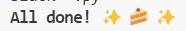

# **Zihan_Mini_1**

[](https://github.com/nogibjj/zihan_mini_1/actions/workflows/hello.yml)

*This is a project scaffold for my future Python project.*

This repo contains my work for the Create Python Gitlab Template assignment of IDS 706. If you want to use this, simply refer to this in a GitHub codespace and wait for the `.devcontainer` to execute the `Makefile`, which handles the following: install, format, lint, and test.

According to the project requirements, the following files are included:

* `Makefile`

* `Dockerfile`

* `requirements.txt` with a set of specifications

* `githubactions`

* `.devcontainer` for GitHub Codespace

## Purpose of project
The purpose of this project is to create a Python template that includes a `main.py` file containing a simple `add(a, b)` function, which returns the sum of two numbers. This function is located in the main part of the file. I test the function using the `test_main.py` file, which verifies the correct behavior of the `add(a, b)` function.

## Future Work
I plan to use this template as the foundation for future projects. I will modify and expand upon it as needed to suit the requirements of upcoming assignments or personal projects. This template provides a solid base for Python development with integrated tools for testing, formatting, and containerization, making it flexible for further development.

## Setup Instructions
To set up this project locally, follow these steps:

1. **Clone the repository**:
    ```bash
    git clone https://github.com/yourusername/your-repo-name.git
    ```
   
2. **Navigate to the project directory**:
    ```bash
    cd your-repo-name
    ```

3. **Build the Docker container** (if you are using Docker):
    ```bash
    docker build -t your-container-name .
    ```

4. **Install the required packages** using the `Makefile`:
    ```bash
    make install
    ```

   This command will install all the necessary dependencies listed in `requirements.txt`.

## Usage Instructions
To use this project:

1. **Run the `main.py` file** to test the `add(a, b)` function:
    ```bash
    python main.py
    ```

2. **Run the tests** using:
    ```bash
    pytest
    ```

3. **Lint the code**:
    ```bash
    make lint
    ```

4. **Format the code**:
    ```bash
    make format
    ```

By following these instructions, you will be able to set up and run the project smoothly.



